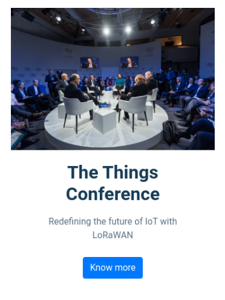
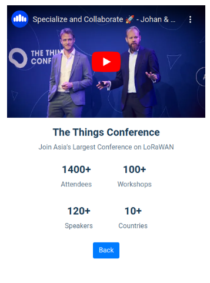

# CONFERENCE PAGE

## Description
Built Conference Page by applying the concepts like HTML, CSS.

## Screenshot

## Technologies Used
- HTML
- CSS
- BOOTSTRAP
- BOOTSTRAP IFRAME

## How to Run
1. Open `index.html` in a browser.
2. Ensure all necessary assets (CSS, images, etc.) are in the correct paths.

## Author
[GitHub Profile](https://github.com/TRINITY2498)