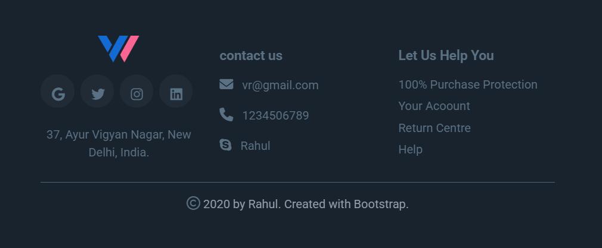

# VR WEBSITE FOOTER SECTION

## Description
Built VR WEBSITE FOOTER SECTION by applying the concepts like HTML, CSS. Also learned to set UI visibility of each sized device.

## Screenshot
 

## Technologies Used
- HTML
- CSS
- BOOTSTRAP
- GRIDING
- UI KIT

## How to Run
1. Open `index.html` in a browser.
2. Ensure all necessary assets (CSS, images, etc.) are in the correct paths.

## Author
[GitHub Profile](https://github.com/TRINITY2498)